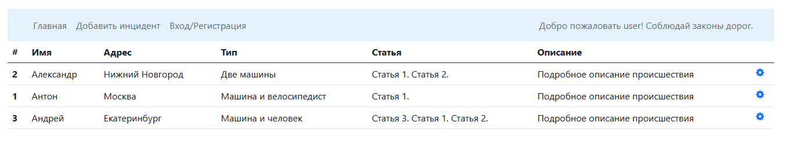
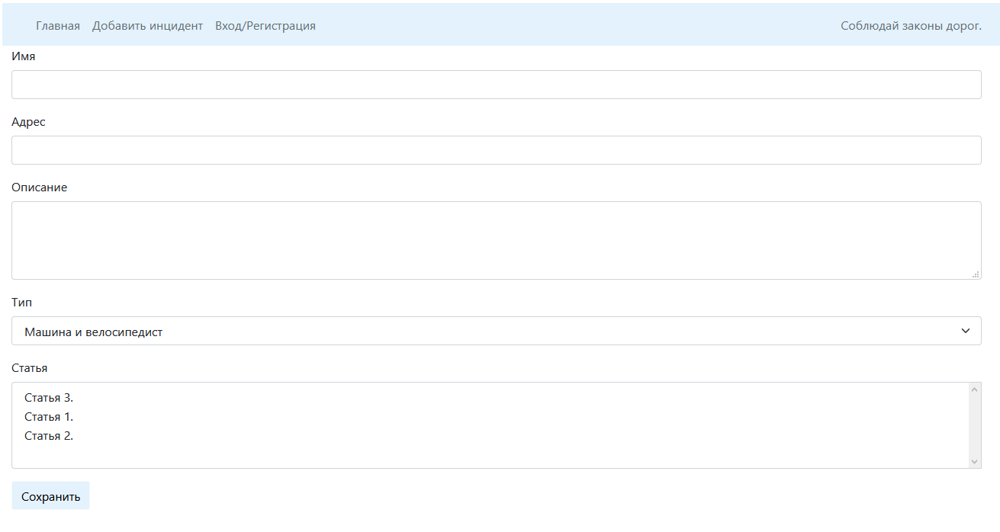
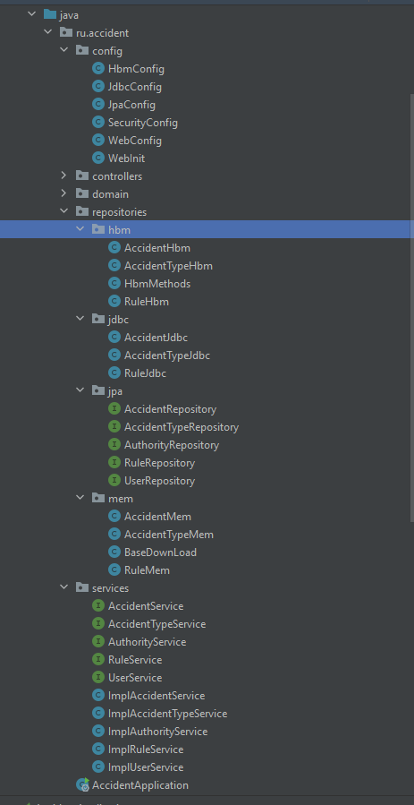

# Цель проекта
Данный проект создавался для изучения работы Spring и его компонентов. На проекте применена концепция внедрения зависимости (DI), как вручную, так и с применением Spring.
Так же Spring MVC - работа с Model, аннотациями, применение Spring Security, Template, ORM и Test.
# Описание проекта
Проект представляет собой сервис для фиксации авто-нарушений.
После регистрации и входа в систему вы увидите список всех нарушений. 
Добавление и редактирование нового нарушения возможно по соответствующей кнопке, 
на форму выгружаются статьи нарушений.

В структуре проекта, можно найти несколько разделов работы с БД, а именно: mem, hbm, jdbc, jpa. 
В каждом пакете представлен отдельный метод для работы с БД: 
mem - имитация БД с сохранением данных в обычную map;
jdbc - работа с БД через JDBC и соответственно JdbcTemplate + необходимая Spring конфигурация JDBCConfig;
hbm - работа с БД через Hibernate и соответственно Spring конфигурация HbmConfig;
jpa - работа с БД через Spring JPA + необходимая Spring конфигурация JpaConfig;

Класс БД внедренный в сервис можно изменить, тем самым можно получить иной способ работы с БД.
Произведено тестирование контроллеров и сервисов.
# Запуск проекта
Для запуска потребуется PostgreSQL.
В resources вы найдете конфигурационный файл application.properties в котором необходимо указать корректные данный для подключения к БД.
При необходимости, для создания таблиц, можете воспользоваться sql скриптом в resources.db.
Для старта можно сконфигурировать Tomcat либо запустить проект за счет SpringBoot (AccidentApplication файл).

